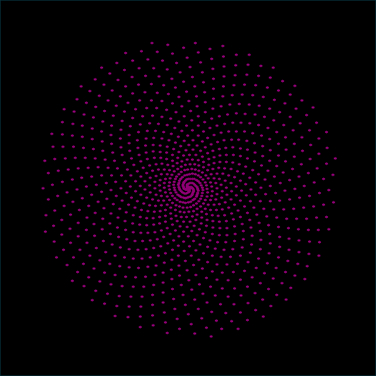

Mitty: A blob of shapes suffering.
==================================

What are curves? I have no idea. Maybe by making some, I will find out. I can
probably find out faster if I can make curves faster. I can make curves faster
if it is easier to describe curves. It would be easier to describe curves if I
had a language and computer program to draw some curves. Also splines are
interesting. I have no idea where this project is going.

Fancy screenshots to come. For now, a golden ratio flower, a butterfly with
normals and an angular random walk.

(Flower)

(Butterfly)

(Swirls)

